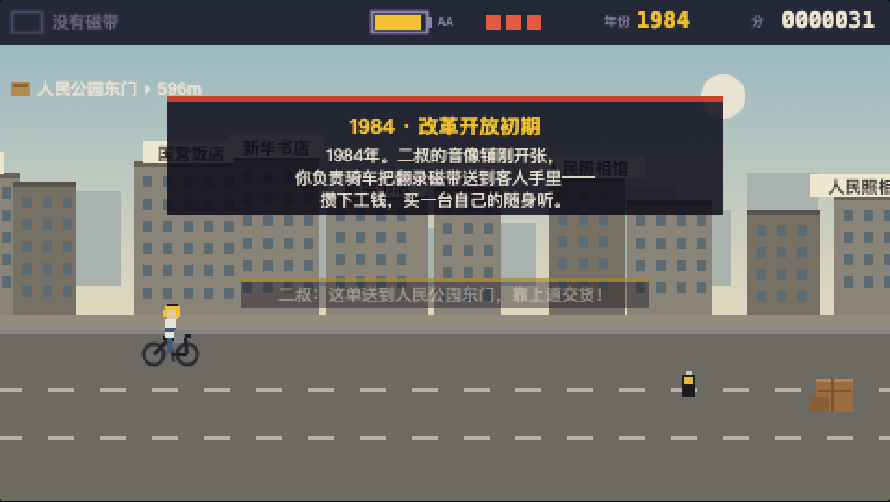
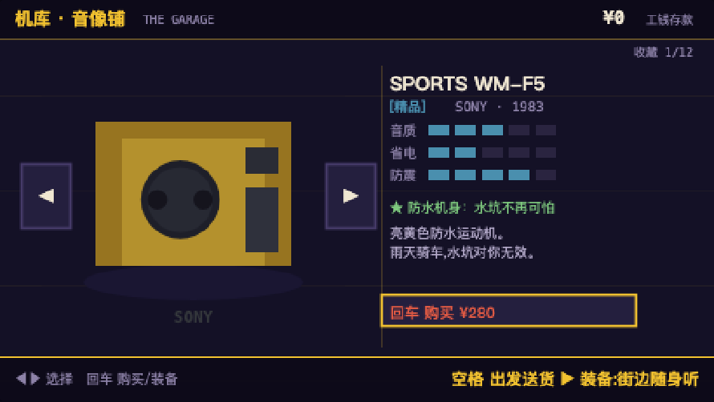

# 随身听年代 · Walkman Days

**▶ 立即游玩 / Play now: https://huangyi1979.github.io/walkman-days/**

无需登录，手机电脑都能玩。手机上点游戏右下角 **⛶** 全屏；iPhone 想要真·全屏，用 Safari 分享菜单 →「添加到主屏幕」，从桌面图标启动。

A pixel arcade game about cassette culture in boom-era China, 1984–1999. Where car culture had Forza Horizon and its garage of classic cars, China's boom years had the Walkman — and this game gives it the same treatment: ride, earn, and collect the legendary machines.



## 故事 · The story

八九十年代的中国，汽车还是遥远的传说，自行车驮着整座城市上下班。你在二叔的音像铺打工——骑车把翻录好的磁带送到录像厅、发廊和学校门口。客人在路边等着，靠上道才能交货；攒下的工钱，就换橱窗里那些索尼、爱华、松下。从1984年一直骑到新千年，直到 MP3 到来的那一天。

You're the delivery kid for your uncle's tape-dubbing shop. Customers wait curbside — swing into the top lane to hand off their order. Your wages fund the collection: twelve classic cassette players, each with real stats that change how the game plays *and sounds*.

## 玩法 · How to play

| | 键盘 Keyboard | 触屏 Touch |
|---|---|---|
| 换车道 Change lane | ▲ / ▼ | 上下滑动 swipe up/down |
| 交货 Deliver | 客人经过时骑在最上道 be in the top lane as you pass the customer | 同左 same |
| 绞带抢救 Rescue a jammed tape | 连按任意键 mash any key | 狂点屏幕 mash the screen |
| 机库 Garage | ◀ ▶ 选择，回车购买/装备，空格出发 | 点按钮 tap the buttons |

- **磁带 Tapes** — 甜歌金曲 / 粤语流行 / 摇滚 / 打口带。捡到哪盘，耳机里就放哪盘：四种曲风是四段实时合成的芯片音乐。
- **电池 Batteries** — 音乐播放时电量持续消耗；电快没时，歌声会变慢、变闷、开始"抖"——就像真的随身听那样。没电就没有得分加成。
- **年代 Eras** — 1984 灰砖供销社 → 1992 金色下海潮 → 1997 霓虹与私家车，一路骑到 2000 年 MP3 登场。



## 机库 · The collection

十二台经典机型，从无牌街边货到传说中的起点之机，属性都会真实影响玩法：

- **音质** = 得分倍率（便宜机器还听得见磁带的沙沙声——音频真的过了低通滤波）
- **省电** = 电池消耗速度
- **防震** = 绞带时铅笔抢救的时间窗口
- **特技** — SONY Sports WM-F5 防水（水坑无效）、AIWA HS-JX2000 重低音（低音真的会变强）、步步高复读机永不绞带、SONY TPS-L2 双耳机口（磁带得分 ×1.5）……
- 两台传奇需要成就解锁：**TPS-L2** 要骑到 2000 年，**WM-DD9** 要一次骑行集齐四种磁带。

进度（存款、收藏、最高分）保存在浏览器本地，每个玩家各玩各的。

## 本地运行 · Run locally

单文件游戏，无依赖、无构建：

```bash
git clone https://github.com/huangyi1979/walkman-days.git
cd walkman-days
python3 -m http.server 8000   # or any static server
# open http://localhost:8000
```

全部内容（画面、音乐、音效）均为运行时程序生成——整个游戏就是一个 HTML 文件加一张图标。

## 技术 · Tech notes

- Vanilla JS + Canvas 2D，480×270 内部分辨率的像素渲染
- WebAudio 实时合成配乐：每种磁带一套旋律/贝斯/鼓，经过随机型参数化的低通、低架滤波与磁带底噪链路；低电量时以播放速率与音分偏移模拟"电池快没了"
- PWA：manifest + 图标，添加到主屏幕即全屏运行；页面内 ⛶ 按钮在竖屏时将画布旋转 90° 铺满长边
- 存档：localStorage

---

*Built with [Claude Code](https://claude.com/claude-code) 🤖📼*
